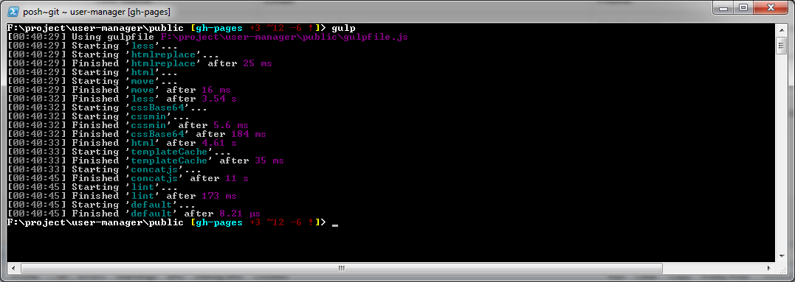

User Management
==========

- User listing
- Create User
- Update User
- Delete User
  


## Live Demo

http://hs105133.github.io/user-manager/build/public

#### Client Side ( Angular JS )

Client side requires REST API in form of JSON response from back-end.

```
cd user-manager
gulp watch
```

#### Server Side (Node, MongoDB, Express)

Back-end is responsible for providing RESTFUL API's nothing more than that, 

1. Node JS
2. Express
3. MongoDB

## REST API

https://hkapi.herokuapp.com/msusers


## Build

Project is ready for production by just running `gulp` from terminal, it will create create build directory inside `user-manager` i,e. root of project folder.

```shell
cd user-manager/public
gulp
```


